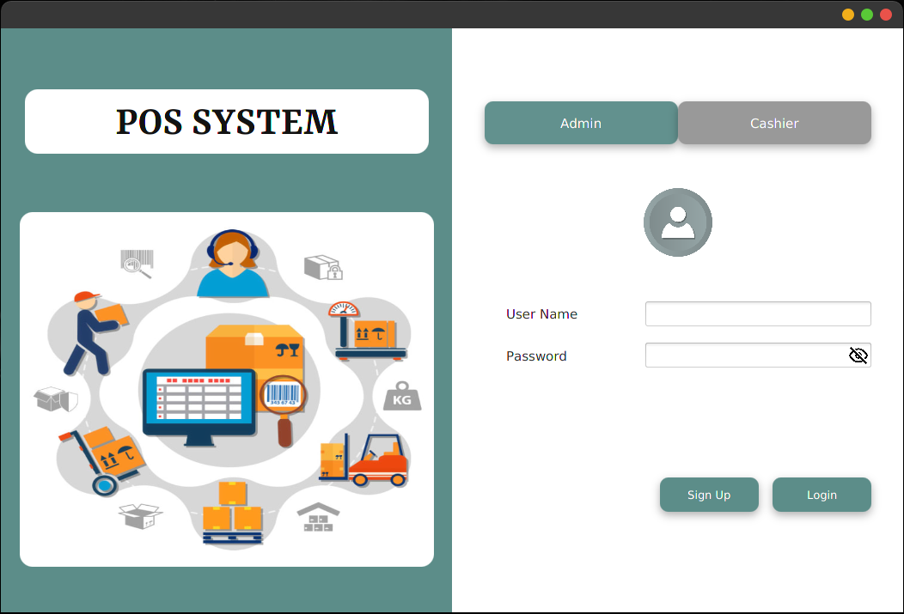
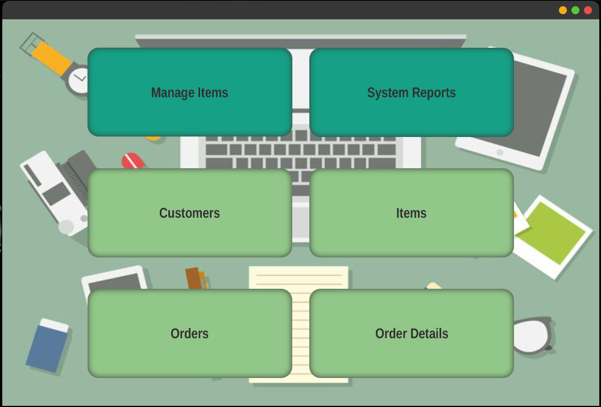
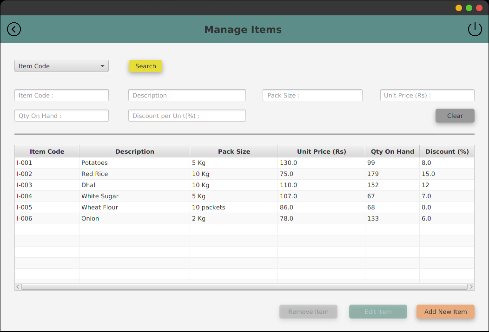
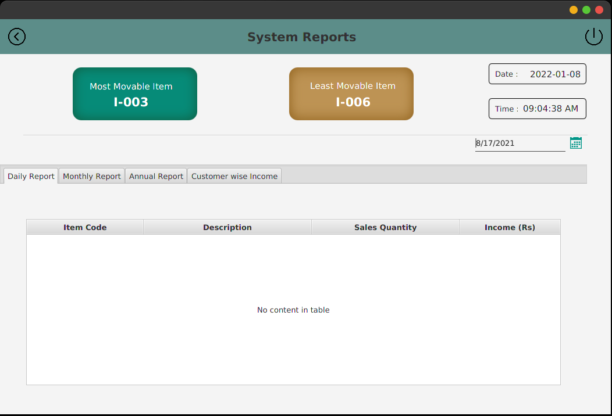
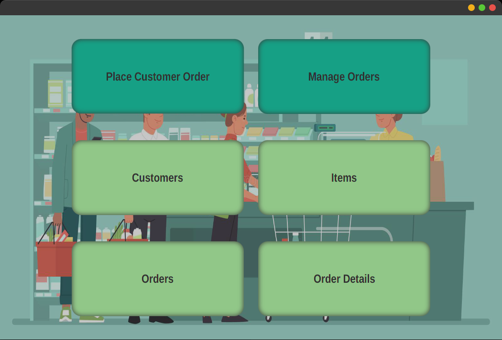
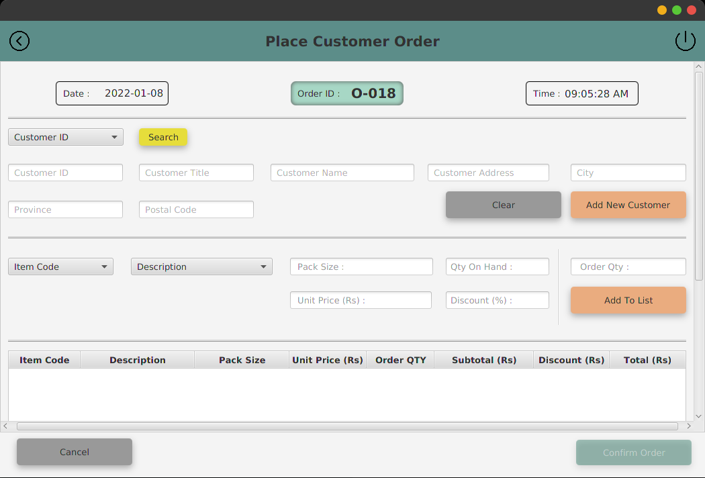
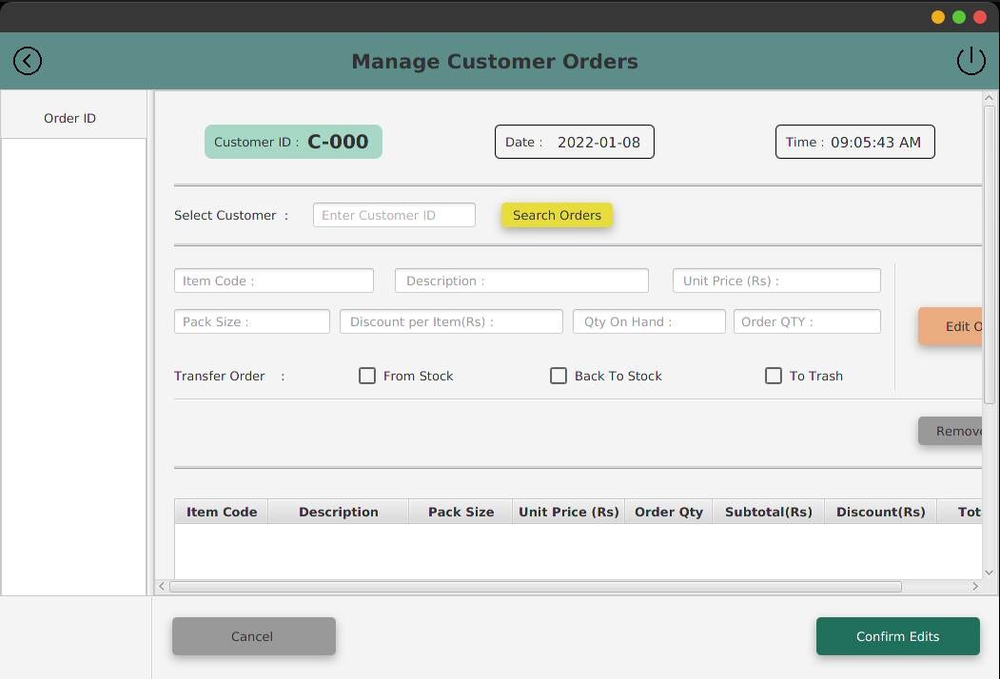

# POS System

Standalone application for a Point Of Sale System with database connectivity. (2021 August)

 

## Objectives :

- To analyze, design and implement a standalone application for a wholesale distributor using the knowledge on JDBC.
- To learn about software architectures and design patterns.
- To get familiar with system documentation and System Manual creation.

 

## Used :

- Java
- Java FX
- JDBC
- MVC Architecture

 

#

 

  
 
Admin Dashboard
  
  
  
 
Cashier Dashboard
  
  

